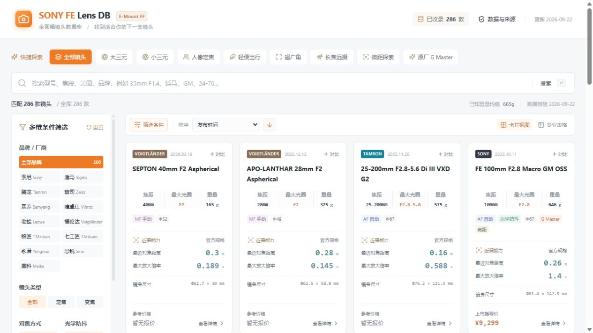
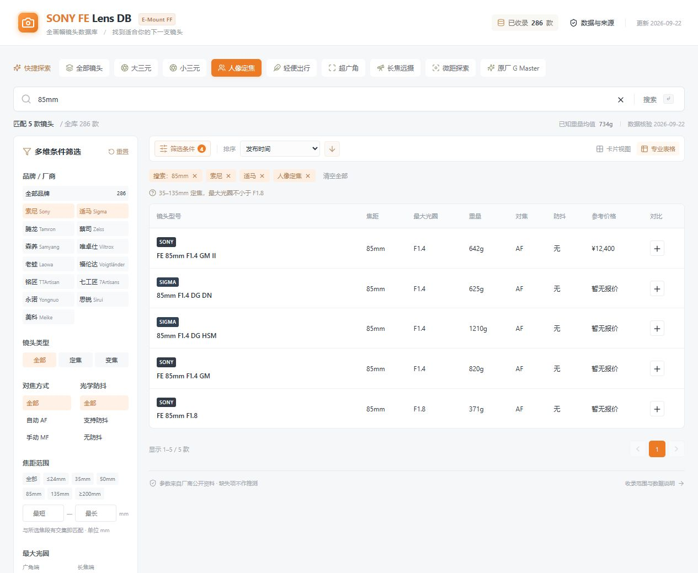
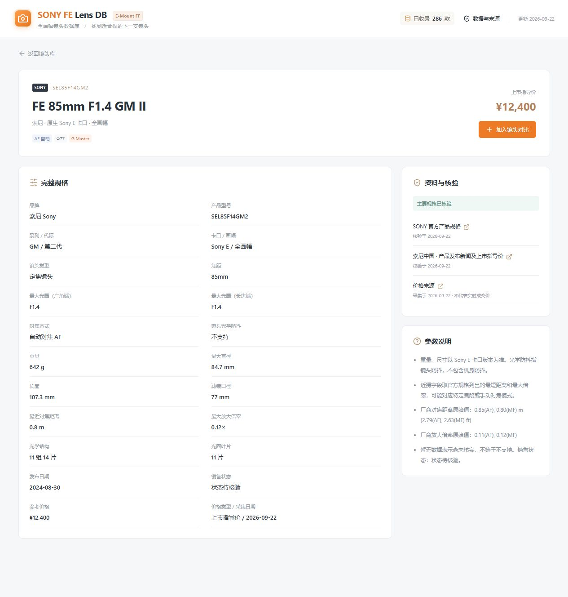
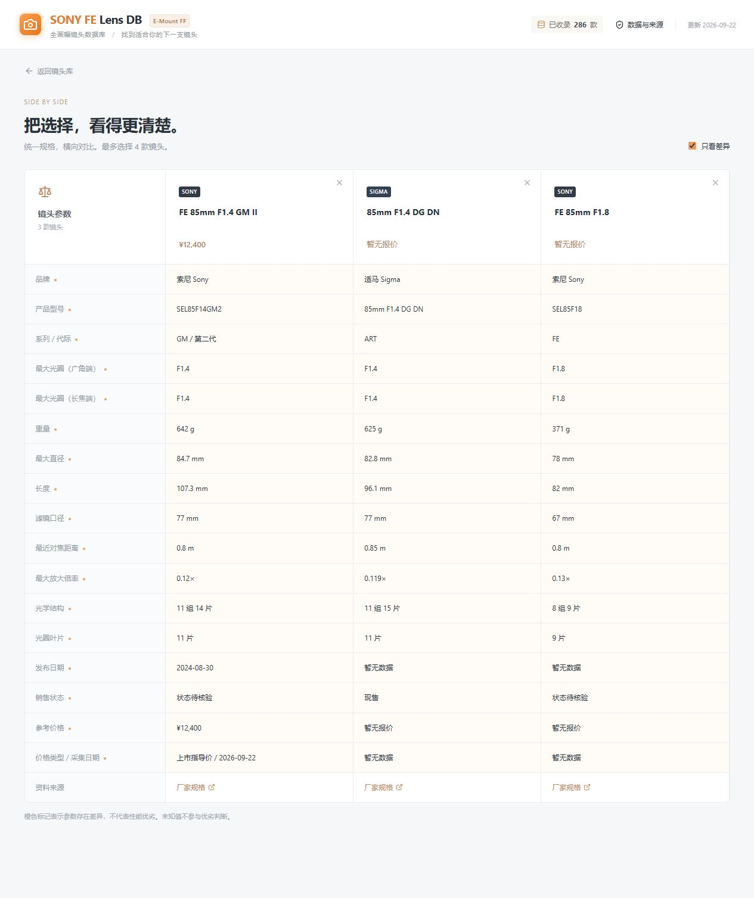

# SONY FE Lens DB

[简体中文](#简体中文) · [English](#english)

## 简体中文

本地运行的简体中文索尼 E 卡口全画幅摄影镜头查询网站。界面采用浅灰底、橙色强调、紧凑卡片与左侧筛选栏，支持搜索、参数筛选、详情及最多四款镜头对比。收录 14 个品牌的 291 款镜头，所有正式记录附资料来源与核验日期。

最新数据整理：2026-09-22 历史资料补充核验，补充 14 款已有镜头的 19 项参数，主要规格完整 226/291 款。详见 [本轮历史资料核验 / Archive review](docs/DATA_ENRICHMENT_2026-09-22_ARCHIVES.md)、[扩大检索记录](docs/DATA_ENRICHMENT_2026-09-22_EXPANDED.md)、[首轮记录](docs/DATA_ENRICHMENT_2026-09-22.md) 与 [覆盖及缺项清单](docs/DATA_COVERAGE.md)。

Latest data update: the archive review adds 19 missing values across 14 existing lenses. Primary specifications are complete for 226 of 291 records; this does not mean every metadata field is complete. Remaining gaps and limitations of indexed historical sources are documented in the linked reports.

后续地区资料核验：再补充铭匠 8 款镜头的 17 个数值参数与 1 个销售状态，明确 E 卡口尺寸、重量及来源差异。[地区核验记录 / Regional review](docs/DATA_ENRICHMENT_2026-09-22_REGIONAL.md)。

Follow-up regional review: 17 numerical values and one sales status added across eight TTArtisan lenses, with Sony E dimensions, weights and source discrepancies documented. Primary-spec completeness remains 226/291 because these records still lack other parameters.

七工匠后续复核：4 款镜头再补 5 个参数，卡口与叶片数冲突继续标注。[核验记录 / 7Artisans follow-up](docs/DATA_ENRICHMENT_2026-09-22_7ARTISANS.md)。Five further values added across four 7Artisans lenses; unresolved mount and diaphragm-count conflicts remain documented.

适马日期复核：补齐 16 款日期，区分旧版公告日与更新版 Sony E 修订发售日。[日期核验 / Sigma date review](docs/DATA_ENRICHMENT_2026-09-22_SIGMA_DATES.md)。Sixteen dates added with explicit announcement-versus-release notes; renewed Sony E models use the revised schedule.

适马历史复核：另补 12 款原生 E 版本公告日期，避免混用单反版本年份。[历史核验 / Historical Sony E review](docs/DATA_ENRICHMENT_2026-09-22_SIGMA_HISTORY.md)。Twelve additional Sony E announcement dates verified; earlier DSLR launch years are not used.

适马 DG DN 复核：再补 10 款 2023—2024 年公告日期。[发布资料核验 / DG DN announcement review](docs/DATA_ENRICHMENT_2026-09-22_SIGMA_DGDN.md)。Ten further dates verified from official US announcements, with generation and mount distinctions preserved.

### 仅供参考 / 数据准确性

**本项目及全部镜头参数、价格、日期和销售状态仅供参考，不保证准确、完整或及时。** 人工整理、来源差异、卡口版本差异及厂商后续调整均可能造成错误或遗漏。记录中的“已核验”仅表示曾对照所列来源，不是厂商认证，也不构成准确性保证。购买、使用或判断兼容性前，请以对应型号与卡口的厂商最新规格、说明书和实际产品为准；不要仅依据本项目作出购买决定。

参考价格可能为历史上市指导价，不是实时成交价或报价承诺。收录数量不代表市场全量；缺失参数不会被推测补齐。发现问题可通过 [Issue](https://github.com/Mixed-reality-optical-imaging/sony-fe-lens-db/issues) 提交型号、字段及可靠来源。

<a id='screenshots'></a>

### 界面与功能展示 / Screenshots

以下图片截自本项目实际运行页面（2026-09-22），界面为简体中文。截图中的规格、价格及销售状态仅用于展示功能，可能不准确或过时，请以厂商最新资料为准。点击图片可查看原图。

These screenshots show the actual running application (2026-09-22), with its Simplified Chinese interface. Specifications, prices and availability are illustrative, may be inaccurate or outdated, and should be checked against current manufacturer information. Click an image to view it at full size.

**1. 镜头库与快捷探索 / Lens library and presets**

通过紧凑卡片浏览焦距、光圈、重量及近摄参数；顶部提供用途快捷筛选，左侧提供品牌与参数筛选。

Browse focal length, aperture, weight and close-focus specifications in compact cards, with presets above and brand/specification filters alongside.

[](docs/screenshots/lens-library.jpg)

**2. 组合搜索与表格视图 / Combined search and table view**

示例同时使用“85mm”搜索、人像定焦规则、索尼与适马品牌多选。表格按统一字段展示结果，便于快速查看差别。

This example combines an “85mm” search, the portrait-prime preset and Sony/Sigma brand selection. The table presents matching lenses in consistent columns.

[](docs/screenshots/search-filters-table.jpg)

**3. 参数详情与来源 / Specifications and sources**

详情页展示完整规格、型号与代际、参考价格类型、来源链接及核验日期，并保留参数差异和缺失项说明。

Each detail page includes specifications, model/generation, price reference type, source links, review dates and notes about limitations or missing values.

[](docs/screenshots/lens-detail.jpg)

**4. 镜头对比与只看差异 / Side-by-side comparison and differences**

示例比较三款 85mm 镜头，并启用“只看差异”。最多支持四款；橙色表示参数不同，不代表性能优劣。

Three 85mm lenses are compared here with “Differences only” enabled. Up to four lenses are supported; orange marks indicate differences, not a performance ranking.

[](docs/screenshots/lens-comparison.jpg)

## 启动（Windows）

下载并解压项目后，可双击 `启动镜头库.cmd`，脚本会在首次启动时安装依赖。保持启动窗口开启，然后访问 **http://127.0.0.1:5173/**。停止时在启动窗口按 `Ctrl+C`。

新电脑需要 Node.js 22.12 或以上的 22.x 版本；当前已在 Node 22.22.1 / npm 10.9.4 下验证。第一次安装依赖需要联网，完成后网站本身不依赖外部服务。

也可以在 PowerShell 中运行：

```powershell
git clone https://github.com/Mixed-reality-optical-imaging/sony-fe-lens-db.git
Set-Location sony-fe-lens-db
npm ci
npm run dev
```

若 5173 端口已被占用，先查看是否已经启动本网站；或执行 `npm run dev -- --port 5174` 并访问终端显示的新地址。网址绑定本机，不向局域网开放。

## 已实现

- 中英文品牌、型号、别名、焦距和光圈搜索；输入后按 Enter 或点击搜索。
- 多品牌并集、不同类别交集；焦段区间按交集匹配；独立筛选变光圈的广角端与长焦端。
- 品牌、定焦/变焦、AF/MF、光学防抖、焦段、光圈、重量、滤镜、人民币价格、销售状态筛选。
- 九个快捷规则、条件标签、排序方向、每页 24 款、卡片与表格视图。
- 数字区间在离开输入框或按 Enter 后应用；反向区间自动交换上下限。
- 筛选、排序、页码、视图保存在 URL；支持刷新、前进和后退。
- `/lenses/:id` 参数详情；`/compare?ids=...` 最多四款对比、只看差异；`/coverage` 覆盖情况及来源。
- 手机筛选抽屉、Escape 关闭、键盘焦点、对比表固定参数列及横向滚动。
- 对比选择保存在本机浏览器 `localStorage`；损坏值会回退为空列表。没有账号、后台或数据库。

## 数据说明

初始交付核验日期：2026-09-22。具体品牌数量、完整程度、型号和来源见 [数据覆盖清单](docs/DATA_COVERAGE.md) 及网站“数据与来源”。收录数量由 JSON 自动计算，**不宣称已覆盖市场全部型号**。

主要依据厂家产品页、规格表、官方商品目录及 PDF。老蛙使用其荷兰地区品牌站，存在单位或尺寸冲突的字段已经留空。部分厂商参数仅有图片、多卡口版本混排或历史资料缺失，正式收录中允许 `null` 并注明原因。完整型号清单和待核验表可继续维护。

人民币价格目前采用少量可核实的索尼中国上市公告，明确标记“上市指导价”，不代表当前成交价；海外价格不换算。没有找到可靠价格时显示“暂无报价”。日期可能是厂商公布的发布或开售日期，具体口径见来源与备注，未知日期排在末尾。

## 数据更新

详见 [数据维护说明](docs/DATA_MAINTENANCE.md)。新增或更新型号只需修改 `src/data/lenses/<品牌>.json`，无需改页面组件。

```powershell
npm run validate:data
npm test
npm run data:report
npm run build
```

`validate:data` 检查必需字段、类型、卡口画幅、日期精度、单位范围、唯一 ID、重复型号和核验状态。校验失败会阻止生产构建。`data:report` 更新覆盖清单，`test` 包含查询、URL、偏好恢复、关键数据回归和 1200 条记录性能检查。

## 生产构建与预览

```powershell
npm run build
npm run preview
```

访问终端显示的地址（默认 http://127.0.0.1:4173/）。生产文件位于 `dist/`。不要双击 `dist/index.html`：网站需要本地 HTTP 服务处理模块和直接访问的详情路由。若以后改用其他静态服务器，需要将不存在的文件路径回退至 `index.html`。

## 文件结构

```text
src/main.tsx             React 启动入口
src/App.tsx              页面、筛选控件、详情、对比、覆盖清单
src/styles.css           主题变量与响应式样式
src/query.ts             纯查询逻辑及 URL / 偏好解析
src/catalog.ts           数据访问和统一展示字段
src/schema.ts            Lens、Source、PriceReference 与运行时校验
src/data/lenses/*.json   按品牌维护的正式镜头记录
src/data/brands.json     品牌名称与颜色
src/data/brand-review.json 品牌清点范围和未覆盖边界
src/data/coverage.json   待核验、排除型号及原因
scripts/validate-data.ts 构建前数据校验
scripts/data-report.ts   生成型号与来源清单
tests/query.test.ts      自动化行为与数据回归测试
docs/                   数据维护、覆盖清单、验收记录
```

框架为 React + TypeScript + Vite。图标由 Lucide 提供，字体使用系统字体，所有查询在浏览器内进行。支持浏览器提供的只读 WebMCP `search_lenses`；不支持该能力的浏览器照常使用完整界面。

## 贡献与许可证

欢迎通过 Issue 报告参数错误、提交官方资料链接，或通过 Pull Request 改进功能和数据。提交数据前请阅读 [数据维护说明](docs/DATA_MAINTENANCE.md)，保留来源、核验日期及缺失字段说明，并运行数据校验、测试和生产构建。

本项目原创代码及维护者有权许可的原创整理内容采用 [MIT 许可证](LICENSE)，按现状提供；具体许可条件、担保排除和责任限制以许可证原文及适用法律为准。数据准确性提示说明项目局限，不对 MIT 授予的使用方式另加限制。

第三方依赖保留各自许可证和版权声明，已安装运行依赖的原文见 [第三方许可声明](public/THIRD_PARTY_NOTICES.txt)，该文件也随生产构建发布。更新依赖后请运行 `npm run licenses:generate` 更新声明；开发依赖的许可证保留在各自 npm 包中。

索尼及其他厂商名称、型号和商标仅用于识别产品；本项目不代表、不隶属于，也未获这些厂商背书。来源链接仅用于溯源，不表示已取得复制、批量抓取或再分发厂商内容的许可。本仓库不包含厂商产品图片、说明书 PDF、完整产品页或采集缓存。

MIT 不重新许可第三方商标、文档、素材或其他受保护内容，也不能免除第三方许可、网站服务条款或适用法律可能规定的义务。**免责声明不等同于授权或合规保证，无法保证所有使用场景均不涉及第三方协议或权利。** 补充数据应采用有权使用的资料，保留来源，避免提交受限制的原文或素材。权利人可通过 Issue 提供具体文件、内容和权利依据，维护者将据此核查、更正或移除相关内容。

参考：[MIT 许可说明](https://choosealicense.com/licenses/mit/) · [GitHub 服务条款](https://docs.github.com/en/site-policy/github-terms/github-terms-of-service)。

## English

An independent, locally hosted database for Sony E-mount full-frame photography lenses, built with React, TypeScript and Vite. The interface is in Simplified Chinese; this README provides documentation in both Chinese and English. The dataset currently contains **291 lenses across 14 brands**, with source links and review dates for every included record. It is not a complete market inventory.

See the [bilingual screenshot gallery](#screenshots) for the lens library, combined search/table view, specifications with sources, and side-by-side comparison.

### Reference only — accuracy is not guaranteed

**All specifications, prices, dates and availability information are provided for reference only and may be inaccurate, incomplete or outdated.** Manual transcription, conflicting sources, mount-specific versions and later manufacturer changes may cause errors. A record marked as reviewed only means it was checked against the listed source; it is not manufacturer certification or a guarantee of accuracy.

Before buying or using a lens, or assessing compatibility, verify the exact model and mount against current manufacturer specifications, manuals and the actual product. Do not base a purchase solely on this database. Prices may be historical launch prices, not live transaction prices or binding quotations. Missing values are displayed as unavailable rather than estimated. Report errors through [Issues](https://github.com/Mixed-reality-optical-imaging/sony-fe-lens-db/issues), including the model, affected field and a reliable source.

### Quick start

Install Node.js 22.x, version 22.12 or later. The project was tested with Node.js 22.22.1 and npm 10.9.4. Installing dependencies requires an internet connection; querying the installed app does not require an external service.

```sh
git clone https://github.com/Mixed-reality-optical-imaging/sony-fe-lens-db.git
cd sony-fe-lens-db
npm ci
npm run dev
```

Open **http://127.0.0.1:5173/** and keep the terminal running. Press `Ctrl+C` to stop. On Windows, you can instead double-click `启动镜头库.cmd`; it installs dependencies on first launch. If the port is occupied, run `npm run dev -- --port 5174`. The server binds to the local machine.

### Features

- Search Chinese/English brand names, models, aliases, focal lengths and apertures.
- Filter by brand, prime/zoom, AF/MF, stabilization, focal range, wide/tele maximum aperture, weight, filter diameter, reference price and sales status.
- Combine brands with OR and filter categories with AND; focal ranges match by overlap.
- Use nine presets, sorting, 24-item pagination, card/table views and URL-based state restoration.
- Open lens details at `/lenses/:id`, compare up to four lenses at `/compare?ids=...`, and inspect coverage at `/coverage`.
- Use a mobile filter drawer and horizontally scrollable comparison table; comparison selections are saved locally in the browser.
- No account, backend database, live price service or subjective scoring is required.

### Data and maintenance

Initial review date: **2026-09-22**. Manufacturer product pages, specifications, catalogs and manuals are the primary references. Conflicting or unavailable values may be `null`, with notes. Dates can refer to announcements or availability dates; check individual source notes. Yuan price references currently include a small set of traceable Sony China launch announcements; overseas prices are not converted.

Edit per-brand files in `src/data/lenses/`. Shared types and validation rules live in `src/schema.ts`; query logic lives in `src/query.ts`. See the [coverage inventory](docs/DATA_COVERAGE.md), [maintenance guide](docs/DATA_MAINTENANCE.md) and [acceptance record](docs/ACCEPTANCE.md) for details (currently in Chinese).

```sh
npm run validate:data
npm test
npm run data:report
npm run licenses:generate
npm run build
npm run preview
```

Validation checks identity, mount, format, units, date precision and duplicate records; invalid data blocks the build. Preview is normally available at **http://127.0.0.1:4173/**. Serve the generated `dist/` directory over HTTP; do not open `dist/index.html` directly. A different static server must fall back to `index.html` for application routes.

### License, third-party rights and contributions

Original code and original compilation work that the maintainers are entitled to license are released under the [MIT License](LICENSE), as is. The license text and applicable law govern permission, warranty exclusions and limitations of liability. The reference-only notice describes data limitations and does not impose additional restrictions on MIT permissions.

Dependencies retain their own licenses and copyright notices. Full notices for installed runtime dependencies are included in [THIRD_PARTY_NOTICES.txt](public/THIRD_PARTY_NOTICES.txt) and copied into production builds. Regenerate them with `npm run licenses:generate` after updating dependencies. Development dependency licenses remain in their respective npm packages.

Manufacturer names, model names and trademarks identify products only. This project is not affiliated with, endorsed by or an official service of Sony or any other manufacturer. Source links document provenance; they do not grant permission to copy, scrape or redistribute third-party material. Manufacturer product images, manual PDFs, complete product pages and collection caches are not included in this repository.

MIT does not relicense third-party trademarks, documents, assets or other protected content, and does not override third-party licenses, website terms or applicable law. **A disclaimer is neither authorization nor a compliance guarantee; we cannot guarantee that every use is free of third-party obligations or rights.** Contributors should submit material they are entitled to share, preserve sources and avoid restricted text or assets. Rights holders may open an Issue identifying the affected file, content and basis of their concern so maintainers can investigate, correct or remove it.

Bug reports, source-backed corrections and pull requests are welcome. Run validation, tests and a production build before submitting changes. References: [MIT license overview](https://choosealicense.com/licenses/mit/) and [GitHub Terms of Service](https://docs.github.com/en/site-policy/github-terms/github-terms-of-service).

2026-09-22 新品补充 / New additions: 新增适马 85mm F1.2 DG Art 与 20–60mm F2.8–4 DG Contemporary，按 Sony E 独立参数收录，注明计划上市日期及待核实字段。Added two announced Sigma lenses with Sony E specifications and explicit pre-launch notes. [核验记录 / Audit](docs/DATA_ENRICHMENT_2026-09-22_SIGMA_NEW.md)。

2026-09-22 永诺补充 / Yongnuo update: 补齐 7 项规格，新增 18mm 与原版 85mm，保留版本区别和官方来源。Resolved seven specifications and added two distinct models. [核验记录 / Audit](docs/DATA_ENRICHMENT_2026-09-22_YONGNUO.md)。
